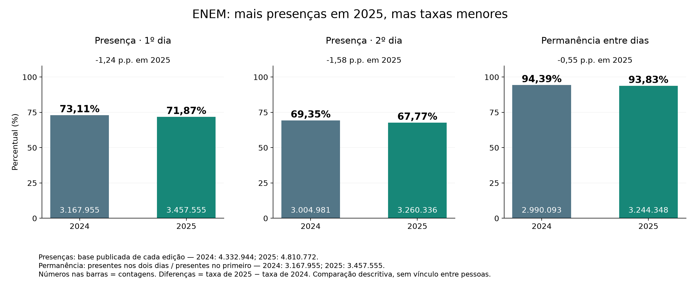

# Participação no ENEM 2024–2025

Etapa 2.1 concluída em 01/10/2026. Incorporada somente a participação entre dias de 2024, com comparação aos indicadores existentes de 2025.

| Indicador | 2024 | 2025 | Diferença 2025 − 2024 |
| --- | ---: | ---: | ---: |
| Registros publicados de RESULTADOS | 4.332.944 | 4.810.772 | +477.828 registros |
| Presentes no primeiro dia | 3.167.955 (73,11%) | 3.457.555 (71,87%) | +289.600 presenças; −1,24 p.p. |
| Presentes no segundo dia | 3.004.981 (69,35%) | 3.260.336 (67,77%) | +255.355 presenças; −1,58 p.p. |
| Presentes nos dois dias | 2.990.093 (69,01%) | 3.244.348 (67,44%) | +254.255 presenças; −1,57 p.p. |
| Permanência dos presentes no primeiro | 94,39% | 93,83% | −0,55 p.p. |

As taxas diárias e de ambos os dias usam o total publicado de cada edição. Permanência usa os presentes no primeiro dia: 3.167.955 em 2024 e 3.457.555 em 2025. As diferenças foram calculadas antes do arredondamento.

**Em 2025 há mais presenças em números absolutos, mas taxas menores nos dois dias e na permanência.** A base publicada também é maior. Essa comparação descreve duas edições; não identifica causas nem acompanha as mesmas pessoas.

Em 2024, 175.619 registros passaram de presente a ausente e 14.004 de ausente a presente. O saldo entre dias foi −162.974 presenças, incluindo outras entradas/saídas, como eliminações; por isso não equivale à ausência estrita após o primeiro dia. Houve 1.145.272 ausentes nos dois dias e 7.956 registros nas demais situações, detalhadas na matriz.



## Como os arquivos se conectam

- [Notebook 08](../notebooks/08_participacao_2024.ipynb): executa preparo mínimo de 2024, cálculo reutilizado e consolidação dos indicadores.
- [Apresentação comparativa executada](participacao_2024_2025.ipynb): lê apenas agregados; contém as tabelas completas, transições e os dois gráficos.
- [Contrato e verificações](../docs/contrato_participacao_2024_2025.md): fontes, campos, regras e critérios de publicação.
- `trusted/participacao_2024_base.parquet`: seis campos, sem excluir nenhum dos 4.332.944 registros.
- `analitica/participacao_2024_*`: dias, pares, transições, combinações conjuntas e resumo. `participacao_2024_2025_*`: dias/transições/resumo com coluna `edicao` e tabela de comparação com denominadores e diferenças.
- `reports/validacao_participacao_2024.json`: único registro de validação novo, com preparo, hashes e 32 controles aprovados.

Para reproduzir a partir da raiz do projeto:

```powershell
.\.venv\Scripts\python.exe -X utf8 scripts\executar_notebook.py notebooks\08_participacao_2024.ipynb
.\.venv\Scripts\python.exe -X utf8 scripts\executar_notebook.py apresentacao\participacao_2024_2025.ipynb
```

Para atualizar apenas a apresentação, basta o segundo comando. As cópias externas dos notebooks conservam saídas para leitura; sua reexecução depende do projeto e do ambiente existente.

## Conferência e escopo restante

Contagens de entrada/saída reconciliadas; nenhum nulo nos seis campos, chave duplicada, edição inválida, código inválido ou par misto. Eliminações preservadas: 5.658 no primeiro dia e 2.303 no segundo. Releitura Parquet sem divergências e raw com SHA-256 idêntico antes/depois. Treze testes focalizados passaram; a regressão real de 2025 reproduziu exatamente os agregados, e os 64 artefatos anteriores conferidos permaneceram idênticos. Notebooks executados e PNGs inspecionados.

Os outros cinco temas de 2024 permanecem **não iniciados**. A apresentação de 2025 foi preservada. Não houve novas dependências, commit ou push. O [roadmap da fase 2](../docs/ROADMAP_FASE_2.md) mantém a incorporação completa de 2024 em andamento.
